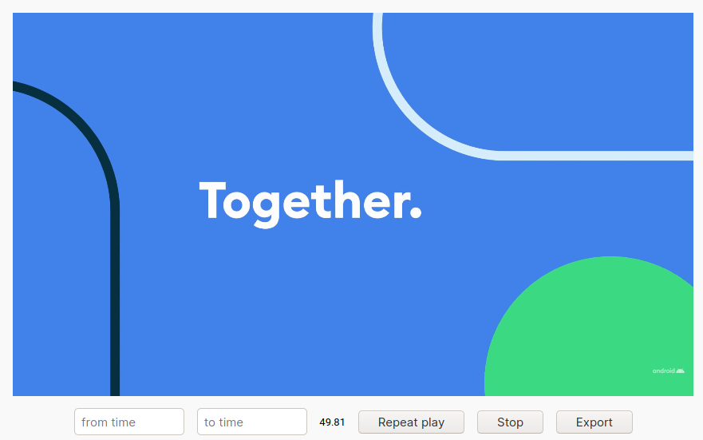

# pvp-youtube

  This userscript shows up a toolbar at the bottom of video to give users better control. Video from <a href="https://www.youtube.com/watch?v=l2UDgpLz20M">here</a>.  
  Android is a trademark of Google.

---

Precise video playback on YouTube/Bilibili. We also generate the clip shell script (audio only by default), and you can easily get the clip running this on a machine with `youtube-dl` (for YouTube) or `yk-dl` (for Bilibili) as well as `ffmpeg`. Useful for video meme creators.

To use this, you need to install [ViolentMonkey](https://github.com/suisei-cn/pvp-youtube/raw/master/pvp.user.js) or [GreaseMonkey](https://www.greasespot.net/) first, then click [here](https://github.com/suisei-cn/pvp-youtube/raw/master/pvp.user.js) to install the script for YouTube, or click [here](https://github.com/suisei-cn/pvp-youtube/raw/master/pvp-bilibili.user.js) to install the script for Bilibili (beta).

[Also available at GreasyFork](https://greasyfork.org/en/scripts/400569-precise-video-playback-youtube).

**Note that this project is not meant to do any harm to anyone who has been in a YouTube video. You shall take the responsibility if your audio or video clip annoys anyone.**

## License

MIT.
