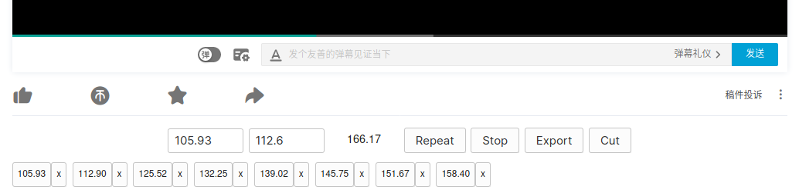

# precise-video-playback (pvp)

  <b>Install: <a href="https://greasyfork.org/en/scripts/400569-precise-video-playback-youtube">pvp for YouTube</a> / <a href="https://greasyfork.org/zh-CN/scripts/406195-precise-video-playback-bilibili">pvp for Bilibili</a></b>

  This userscript shows up a toolbar at the bottom of video to give users better control. Video from <a href="https://www.youtube.com/watch?v=ImSW1g02FUk">here</a> and <a href="https://www.bilibili.com/video/av69216443">here</a>*.  

---

**\* For users of pvp for Bilibili**: Bilibili has rolled out a note-taking feature for logined users. We suggest you use that as an alternative when possible since pvp for bilibili is still unstable due to unpredictable Bilibili native scripts.

---

Precise video playback on YouTube/Bilibili. We also generate the clip shell script (audio only by default), and you can easily get the clip running this on a machine with `youtube-dl` as well as `ffmpeg`.

## Feature

- Better control your video playback
- Quick jump
- Quick repeat
- Add cut points
- Import/export cut points
- Generates `ffmpeg` scripts for the audio clip
- Free and open source!

It is for you if you need to:

- Cut multiple audio clips from a video
- Do the timing for a video
- Share a clip of a video to others

## Usage

To use this, you need to install a userscript manager such as [ViolentMonkey](https://violentmonkey.github.io/) or [GreaseMonkey](https://www.greasespot.net/).

Then, install this on GreasyFork: [pvp for YouTube](https://greasyfork.org/en/scripts/400569-precise-video-playback-youtube) or [pvp for Bilibili](https://greasyfork.org/zh-CN/scripts/406195-precise-video-playback-bilibili).

**Note that this project is not meant to do any harm to anyone who has been in a YouTube video. You shall take the responsibility if your audio or video clip annoys anyone.**

## License

MIT.
